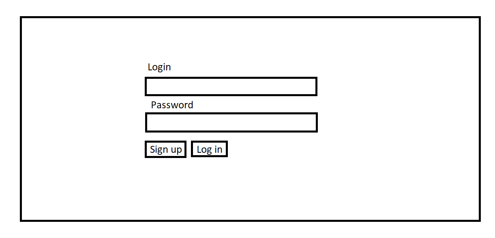
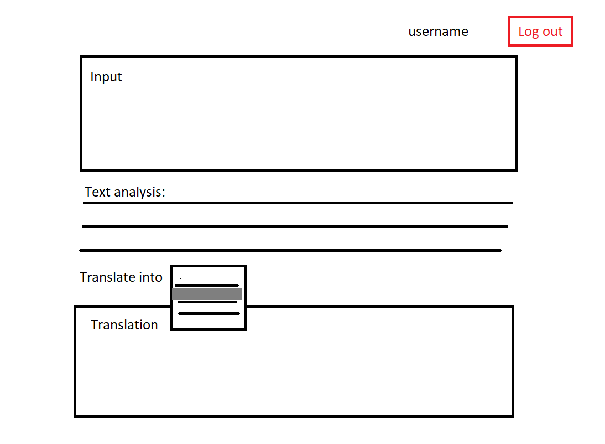
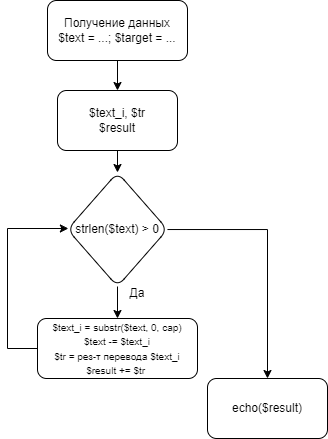
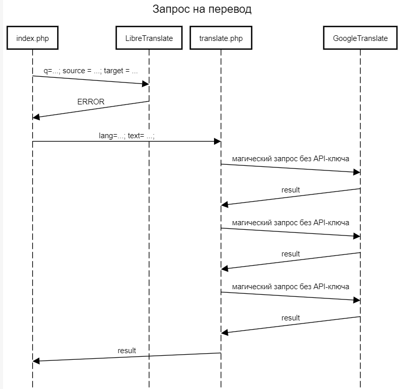
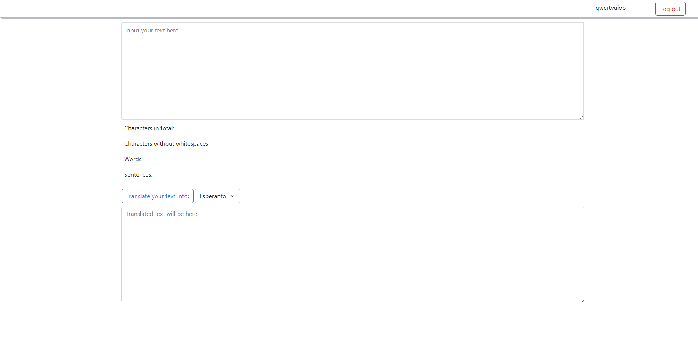
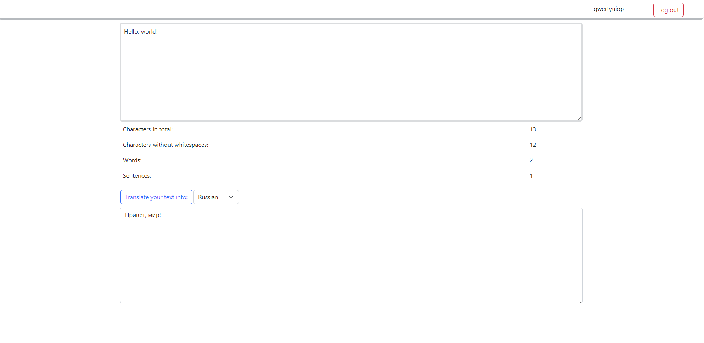
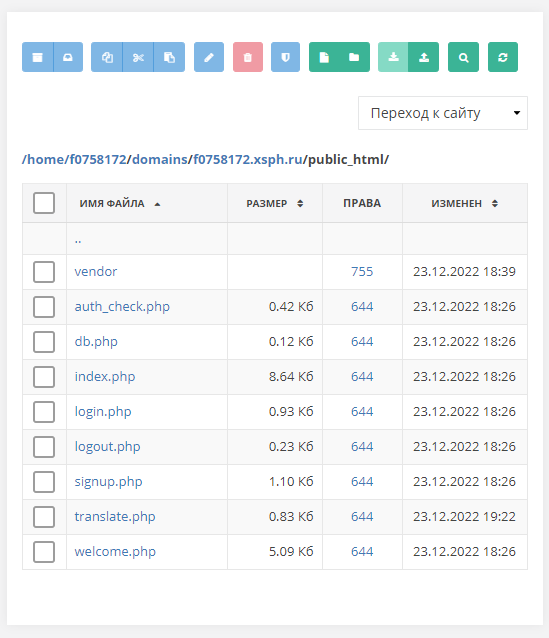

# Отчёт о курсовой работе
#### *По курсу "Основы Программирования*
#### *Работу выполнил студент группы №3131 Иванов А.М.*

## Изучение предметной области

Сайты с СЕО-анализом текста зачастую выдают слишком много информации, к тому же непонятной ~~непосвящённым~~ не разбирающимся в копирайте. Зачем куча параметров, когда зачастую нужно только знать количество знаков без пробелов или, например, число предложений?

Сайты с переводчиками зачастую либо не дают информацию о переводимом тексте, либо для её получения нужно куда-то дополнительно тыкать, открывать всплывающие окна, и т.д. и т.п. Неудобно, одним словом. 

Почему бы не совместить два в одном: поверхностный анализ текста + переводчик?

~~*Uhh! Pen-Pineapple-Apple-Pen!*~~

## Составление ТЗ

- Базовая система авторизации и выхода из аккаунта
- Ни голого html, ни самопального css. От внешнего вида проекта у посетителя **не** должна идти кровь из глаз
- Простенький анализ текста: сколько знаков, сколько знаков без учёта пробелов, сколько слов, сколько предложений
- Переводчик, подключённый через **внешнее API**

#### *Дополнение к четвёртому пункту:*

Как выяснилось за сутки до срока сдачи, с получением **API-ключей** ко всем переводчикам из тех, что мне удалось найти: либо при регистрации *(даже на бесплатный период)* требуются данные кредитной карты *(а отечестенные карты, конечно же, не принимаются)*, либо же **API-ключ** бесплатный, но как его получить — решительно непонятно. 

В конечном итоге, мне попался GitHub'овский [репозиторий](https://github.com/LibreTranslate/LibreTranslate) **LibreTranslate**, где даже был приведён пример **fetch()**-запроса. 100% free, говорили они. Фактически, для запросов на сайт сервиса нужно покупать подписку в 29$/мес. Зато можно самому скачать исходные файлы и захостить свой сервер. Но ведь тогда это не будет **внешним API**! 

Ещё одним вариантом оказалась библиотека [php-google-translate-for-free](https://github.com/dejurin/php-google-translate-for-free), магическим образом совершающая запросы к сервису **GoogleTranslate**, не имея при этом **API-ключа**. Но это ведь готовое решение, никак не демонстрирующее мои собственные умения!

Придётся совмещать. Итого, пункты пятый и шестой:

- Отправлять полностью корректные *( за исключением отсутствующего* ***API-ключа*** *)* запросы на сайт **LibreTranslate**. Поймав ошибку, выполнять идентичеые запросы через [php-google-translate-for-free](https://github.com/dejurin/php-google-translate-for-free)
- Обходить ограничение по количеству символов, установленное [php-google-translate-for-free](https://github.com/dejurin/php-google-translate-for-free)

## Выбор технологий

#### *Платформа:*
Бесплатный хостинг **free.sprinthost.ru**. *(Или я неправильно термин "платформа"? Как бы то ни было — вот [ссылка](http://f0758172.xsph.ru) на итоговый сайт)*

#### *Среда разработки:*
Visual Studio Code.

#### *Языки программирования:*
PHP, JavaScript.

#### *Фреймфорки:*
**Bootstrap**, чтоб было эстетически ~~красиво~~ приемлемо.

#### *Библиотеки:*
Не раз помянутая выше [php-google-translate-for-free](https://github.com/dejurin/php-google-translate-for-free), добытая в тяжёлом бою с пакетным менеджером **Composer"**

## Реализация

### Пользовательский интерфейс:
- *Концепт формы авторизации:*

- *Концепт интерфейса основной страницы* 

### Пользовательский сценарий:

Пользователь заходит на сайт, его перекидывает на форму входа/регистрации *(welcome.php)*. Там пользователь входит в свою учётную запись, при необходимости предварительно зарегистрировавшись. После входа он попадает на главную страницу *(index.php)*, где он может

- Выйти из учётной записи и попасть обратно на форму входа/регистрации
- Ввести текст в поле для ввода
- Узнать результаты поверхностного анализа текста
- Перевести текст на нужный ему язык

### API сервера:

При регистрации/авторизации пользователя используются **fetch()**-запросы с методом **POST** и полями *login* и *pass* 

При запросе на сайт **LibreTranslate** используются **fetch()**-запросы с методом **POST** и полями **q**, **source** и **target** для передачи переводимого текста, языка исходника и языка, на который нужно перевести, соответственно.

При работе с библиотекой [php-google-translate-for-free](https://github.com/dejurin/php-google-translate-for-free) используются **fetch()**-запросы с методом **POST** и полями **lang** и **text** для передачи переводимого текста и языка, на который нужно перевести, соотетственно.

### Хореография 

**index.php**, при отсутствии токена авторизации, перенаправляет пользователя на страницу **welcome.php**. Если токен есть и он корректен, то перенаправление не происходит. При нажатии на кнопку **Log out** сервер отправляет **fetch()**-запрос **leave.php** *(в результате запроса токен авторизации будет уничтожен)* и направляет пользователя на **welcome.php**

Со страницы **welcome.php**, при нажатии кнопки **"Sign up"**, сервер отправляет **fetch()**-запрос на **signup.php** *(тут данные будут проверены и, если всё ок, внесены в БД)*, передавая туда введённые в поля **"Login"** и **"Passsword"** данные. **signup.php** после обработки данных возвращает  индикатор, в зависимости от значения которого будет выведено сообщение об ошибке или успешной регистрации. 

При нажатии на странице **welcome.php** кнопки **"Log in""**, сервер направит на **login.php** **fetch()**-запрос с введёнными данными. **login.php** проверяет данные на корректность и возвращает индикатор, в зависимости от значения которого будет выведено сообщение об ошибке или пользователь получит токен авторизации и будет перенаправлен на **index.php**. 

При нажатии кнопки **"Translate into"** на странице **index.php** отправляется **fetch()**-запрос на сайт **LibreTranslate**, результат которого будет будет выведен в окно перевода. Если запрос возвращает ошибку, то отправляется **fetch()**-запрос на страницу **translate.php**, результат которого будет выведен в окно перевода.

### Структура базы данных

База данных состоит из одной таблицы **users**, со стобцами **id** *(ключевой, с автоинкрементом)*, **login** *(хранение логинов)*, **hash** *(хранение хешей паролей)* и **token** *(хранение токена авторизации)*

### Алгоритмы

Алгоритм обхода ограничения библиотеки [php-google-translate-for-free](https://github.com/dejurin/php-google-translate-for-free) по количеству слов в переводимом тексте 

*cap* здесь — предельное количество символов. Экспериментальным путём было установлено, что *cap* = 3885, хотя в документации библиотеки [php-google-translate-for-free](https://github.com/dejurin/php-google-translate-for-free) был указан лимит в 5000 знаков.

### Пример HTTP запросов/ответов

### Значимые фрагменты кода
**fetch()**-запрос при регистрации:

    let signup = document.querySelector('#btn_signup');
    signup.addEventListener('click', () => {
        fetch('http://localhost/Lab6/signup.php',  {method: 'POST', body: new FormData(form) })
        .then( resp => {
            return resp.text();
        })
        .then( msg => {
            flag = msg;
            if (flag>0) {
                flag_text.setAttribute('class', 'text-center fs-4 fw-bold text-danger');
                switch(flag) {
                    case "1":
                        flag_text.innerHTML = "Incorrect login or password";
                    break;
                    case "2":
                        flag_text.innerHTML = "This login is already taken";
                    break;
                    case "3":
                        flag_text.innerHTML = "Password must be longer than 5 letters. It also must include at least one latin letter and at least one number";
                    break;
                    default:
                    break;
                }
            } else if (flag == -1) {
                flag_text.setAttribute('class', 'text-center fs-4 fw-bold text-success');
                switch(flag) {
                    case "-1":
                        flag_text.innerHTML =  "Successfull signup";
                    break;
                    default:
                    break;
                }
            }
        });
    });

**fetch()**-запрос при авторизации:

    let login = document.querySelector('#btn_login');
    login.addEventListener('click', () => {
        fetch('http://localhost/Lab6/login.php', {method: 'POST', body: new FormData(form) })
        .then( resp => {
            return resp.text();
        })
        .then( msg => {
            flag = msg;
            if(flag == 1) {
                flag_text.setAttribute('class', 'text-center fs-4 fw-bold text-danger');
                flag_text.innerHTML = "Incorrect login or password";
            } else if (flag == -1) {
                window.location.href = 'http://localhost/Lab6/index.php';
            }
        }) 
    });

Анализ текста с помощью регулярных выражений:

    setInterval( () => {
        input_cur = input.value;
        if ( input_cur != input_prev) {
            chars_t = input_cur.length;
            chars_nw = (input_cur.match(/\S/g) ?? '').length;
            words = (input_cur.match(/\S+/g) ?? '').length;
            sentences = (input_cur.match(/\w([.?!](\s|$)|$)/g) ?? '').length;
    
            document.querySelector('#chars_t').innerHTML = chars_t;
            document.querySelector('#chars_nw').innerHTML = chars_nw;
            document.querySelector('#words').innerHTML = words;
            document.querySelector('#sentences').innerHTML = sentences;
            input_prev = input_cur;
        }
    }, 1000);

Запрос на перевод:

    translate_btn.addEventListener('click', () => {
        text = input.value;
        lang = document.querySelector('#lang').value;
        
        fetch("https://libretranslate.com/translate", {
            method: "POST",
            body: JSON.stringify({
                q: text,
                source: "auto",
                target: lang
            }),
            headers: { "Content-Type": "application/json" }
        })
        .then( resp => {
            if (resp.ok) {
                return resp.json();
            } else {
                throw new Error();
            }
        })
        .then( msg => {
            translation.value = msg['translatedText'];
        })
        .catch(() => {
            data = new FormData();
            data.append("lang", lang);
            data.append("text", input.value)
            
            fetch("http://localhost/Lab6/translate.php", { method: "POST", body: data })
            .then( resp => {
                return resp.text();
            })
            .then( msg => {
                translation.value = msg;
            })
            .catch(() => {console.log('local translation error')})
        });
    });

Код **translate.php**:

    require_once ('vendor/autoload.php');
    use \Dejurin\GoogleTranslateForFree;
    
    $source = 'auto'; $target = $_POST['lang'] ?? 'eo'; $attempts = 5;
    $text = $_POST['text'] ?? null; $text_i = '';
    $flag = null; $result = '';
    
    if ($text) {
        $GTFF = new GoogleTranslateForFree();
        
        while (strlen($text) > 0) {
            $text_i = substr($text, 0, 3885);
            $text = substr($text, 3885);
            $tr = $GTFF->translate($source, $target, $text_i, $attempts);
            $result = $result.' '.$tr;
        }
        
        preg_replace('/\s+/', ' ', $result); //во избежание двойных пробелов
        $result = substr($result, 1); //убираем лишний пробел в начале
        echo($result);
    }
    else echo("Empty request, there's nothing to translate.");

## Тестирование

Регистрируемся:

Авторизовались, видим главную страницу:

Введём "Hello, world!" и попробуем перевести на русский:

Всё работает!

## Внедрение

 #### Файлы на хостинге:                      
 
 
 *Примечание: папка vendor и всё её содержимое автоматически добавлены пакетным менеджером* ***Composer*** *при обработке файла* ***composer.json*** *который можно найти в данном репозитории. На хостинг я его загружать не стал за ненадобностью.*
 
 #### БД на хостинге:                  
 
 
## Поддержка
Не требуется. Логов нет, администрирование осуществляется через хостинг.

